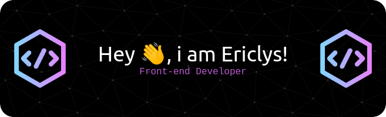

<!-- ### Hi there 👋
  

  
 -->

- 🔭  I’m currently Freelancer

- 🌱  I’m always studying **JavaScript, ReactJS (NextJS), React Native, TypeScript, NodeJS (Nest)**

- 💬  Ask me about **Linux 🐧**

- 🚀  How to reach me  [.dev](https://up-portfolio.vercel.app/)

 

## 🛠 &nbsp;Tech Stack

&nbsp;
&nbsp;
&nbsp;
&nbsp;
&nbsp;
&nbsp;
&nbsp;
&nbsp;
&nbsp;
&nbsp;

## ⚙️ &nbsp;GitHub Analytics
 

##

  

